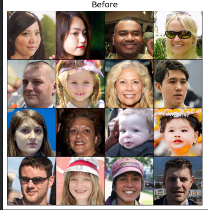
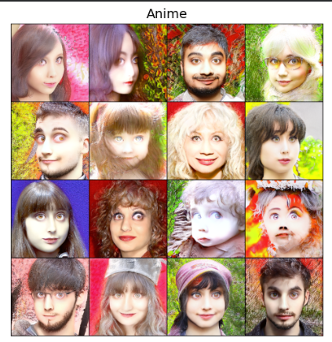
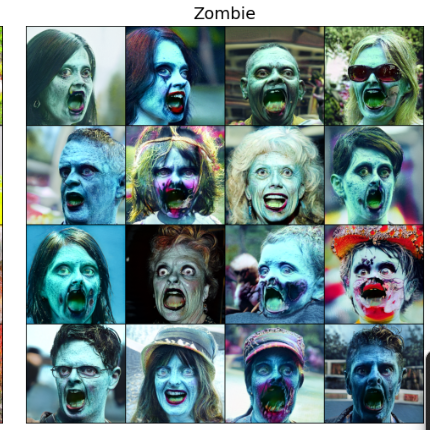
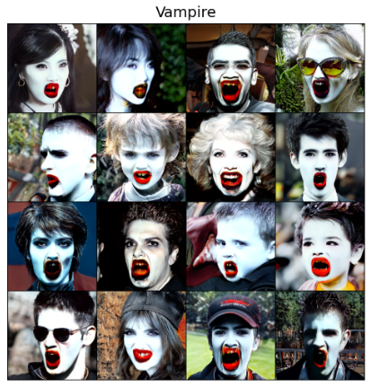
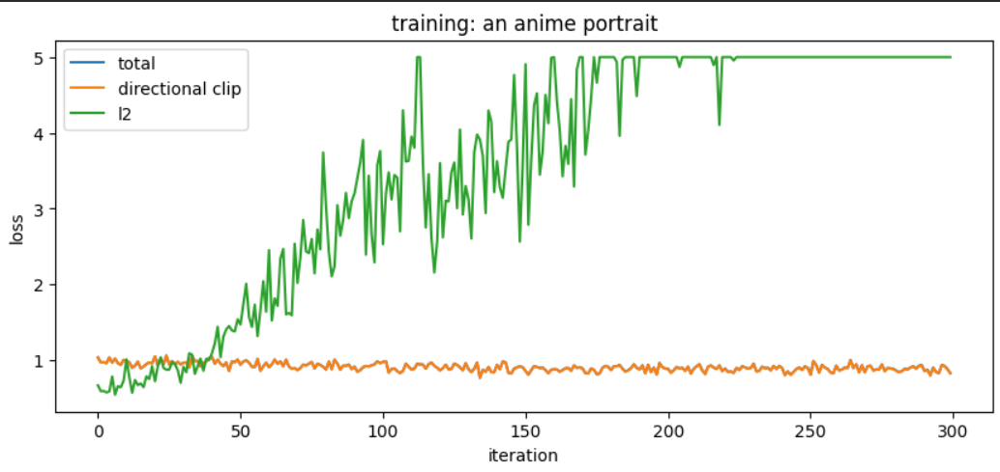
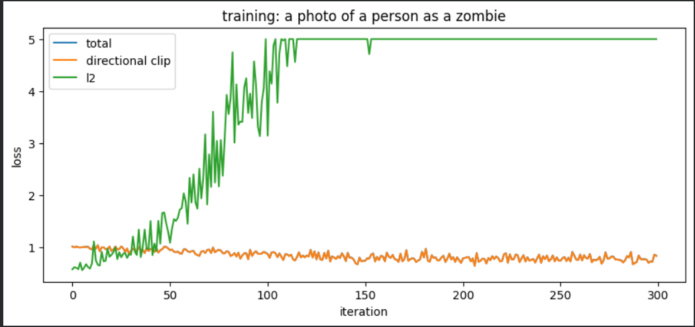
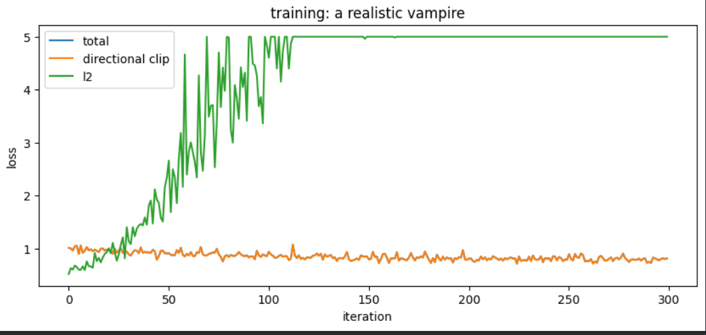

# StyleCLIP-NADA Face Editing
Text-driven face editing based on StyleCLIP-NADA with experiments on different training strategies.

## Project Overview
This project investigates text-driven face editing using StyleCLIP-NADA.
Several training strategies for the mapper network are explored, including latent-space regularization and generator fine-tuning.
The final model supports semantic editing of human faces into three target styles: anime portrait, zombie, and realistic vampire.

### Pipeline


## Installation
The project is designed to run in **Google Colab**.

### 1. Clone the repository

```bash
git clone https://github.com/YOUR_USERNAME/styleclip-nada-face-editing.git
cd styleclip-nada-face-editing
```

### 2. Install dependencies

```bash
pip install -q ninja
pip install -q ftfy regex tqdm
pip install -q git+https://github.com/openai/CLIP.git
```

### 3. Download pretrained StyleGAN2-ADA weights

Create the `weights` directory and download the pretrained FFHQ generator:

```bash
mkdir -p weights

wget -q -O weights/ffhq.pkl \
https://nvlabs-fi-cdn.nvidia.com/stylegan2-ada-pytorch/pretrained/ffhq.pkl
```

### 4. Download pretrained mapper checkpoints

Download the trained mapper checkpoints from Hugging Face:

https://huggingface.co/tvictoria/styleclip-nada-ffhq

Place the downloaded `.pt` files into the `checkpoints/` directory.

### 5. Run the notebooks

Open the notebooks from the `notebooks/` directory and execute the cells sequentially.

## Repository Structure
```text
styleclip-nada-face-editing/
│
├── checkpoints/      
├── images/           
├── notebooks/        
├── src/              
│
├── .gitignore
├── LICENSE
├── README.md
└── Experimental_Report.pdf
```

## Usage

### training.ipynb

Used to train the mapper network using Directional CLIP Loss.

### validation.ipynb

Evaluates the trained mapper, computes validation losses and visualizes edited images.

### inference.ipynb

Applies pretrained mapper checkpoints to new latent codes and generates edited images.

## Results

### Baseline



### Qualitative Results

#### Anime



#### Zombie



#### Vampire



### Training Loss

#### Anime



#### Zombie



#### Vampire



## Experimental Report

A detailed description of all conducted experiments, training settings, hyperparameter analysis, and qualitative evaluation is available in the accompanying report:

📄 **[experimental_evaluation.pdf](experimental_evaluation.pdf)**
└── Experimental_Report.pdf
```
