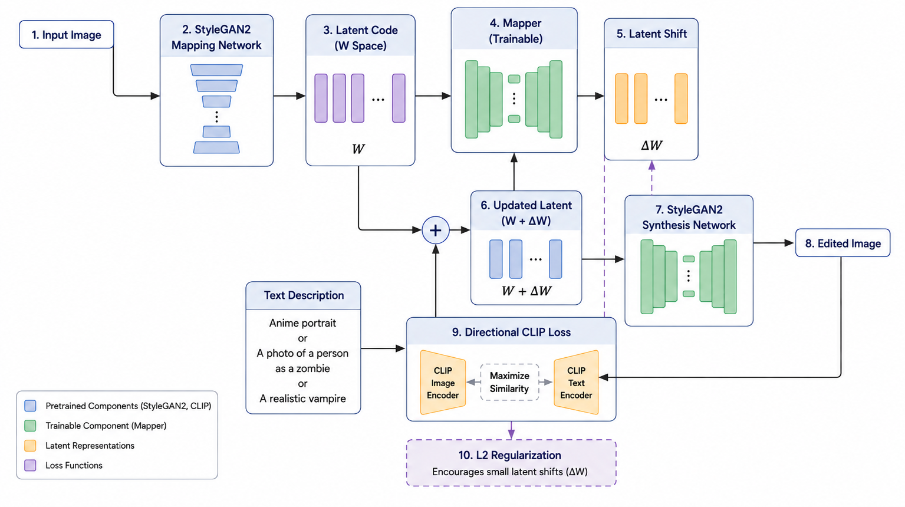

# StyleCLIP-NADA Face Editing
Text-driven face editing based on StyleCLIP-NADA with experiments on different training strategies.

## Project Overview
This project investigates text-driven face editing using StyleCLIP-NADA.
Several training strategies for the mapper network are explored, including latent-space regularization and generator fine-tuning.
The final model supports semantic editing of human faces into three target styles: anime portrait, zombie, and realistic vampire.

### Pipeline

